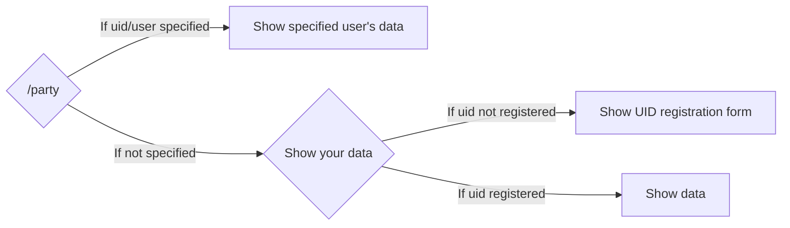

# /party
## Overview
Generate a Genshin party build card.

## Usage
```
/party <option>
```

Option | Description | Required
--- | --- | --
uid / user | Show another user's data. | No
score | Change score calculation method. | No

score option values include:
- ATTACK-based
- HP-based
- DEFENCE-based
- ENERGY RECHARGE-based
- ELEMENTAL MASTERY-based

## Flow


## Preview

