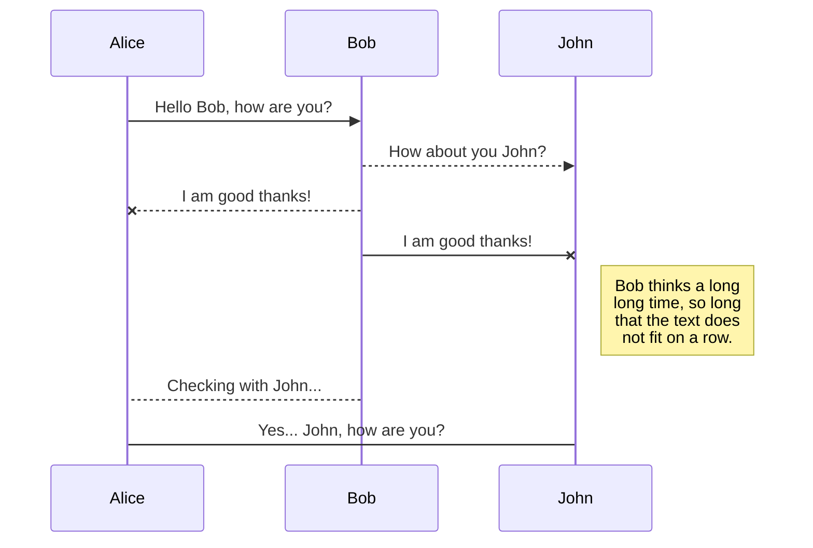

> sample
{.is-success}

> sample
{.is-info}

> sample
{.is-warning}

> sample
{.is-danger}

> sample


---

```
sample
sample
sample
sample
```

---



---

[Home Pages](https://krnk.org)

---

sample <kbd>CTRL</kbd> + <kbd>C</kbd>

---

斜めになる *sample* 

---

色をつける `sample` 

---

# Header 1
## Header 2
### Header 3
#### Header 4
##### Header 5
###### Header 6

---

引用を作成

This sentence[^1] needs a few footnotes.[^2]

[^1]: A string of syntactic words.
[^2]: A useful example sentence.

---

:apple:

Can be also be used :fire: inline

---

Tab形式のテーブル

# Tabs {.tabset}
## First Tab

sample

## Second Tab

sample

## Third Tab

sample
