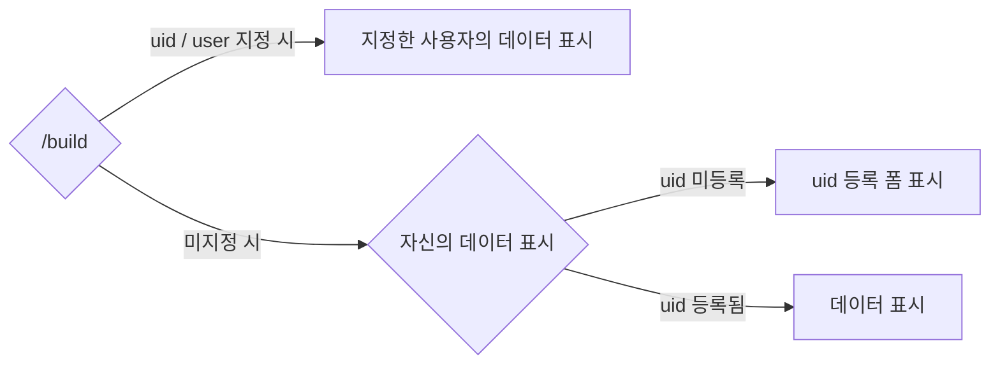

# /build-hsr
## 개요
스타 레일(Honkai: Star Rail) 빌드 카드를 생성합니다.

## 사용법
```
/build-hsr <option>
```

옵션 | 설명 | 필수 여부
--- | --- | --
uid / user | 다른 사용자의 데이터를 표시합니다. | 아니요

## 동작 흐름

```mermaid
graph LR
    A{/build}
    A -->|uid / user 지정 시| B[지정한 사용자의 데이터 표시]
    A -->|미지정 시| C{자신의 데이터 표시}
    C -->|uid 미등록| D[uid 등록 폼 표시]
    C -->|uid 등록됨| E[데이터 표시]
```

## 미리보기

