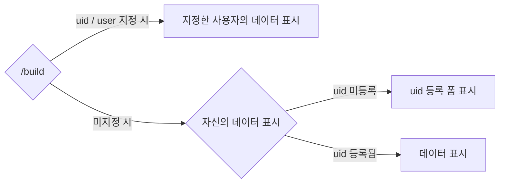

# /build
## 개요
원신(Genshin) 빌드 카드를 생성합니다.

## 사용법
```
/build <option>
```

옵션 | 설명 | 필수 여부
--- | --- | --
uid / user | 다른 사용자의 데이터를 표시합니다. | 아니요
score | 점수 계산 방식을 변경합니다. | 아니요

score 옵션 값 예시:
- 공격력 기준
- HP 기준
- 방어력 기준
- 원소 충전 효율 기준
- 원소 돌파(원소 숙련) 기준

## 동작 흐름


## 미리보기

