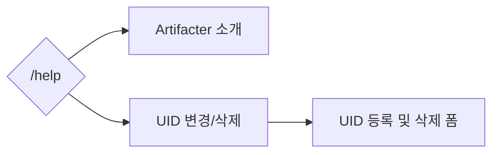

# /help
## 개요
명령어 설명을 표시하고 UID 변경/삭제를 수행할 수 있습니다.

> 명령어 설명의 내용은 [Artifacter 소개](about.md)와 동일합니다.
{.is-info}

## 사용법
```
/help
```

## 동작 흐름

```mermaid
graph LR
    A{/help}
    A --> B[Artifacter 소개]
    A --> C[UID 변경/삭제]
    C --> D[UID 등록 및 삭제 폼]
```
