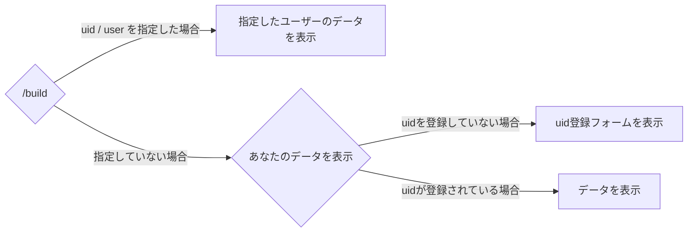

# /build-hsr
## 概要
スターレイルのビルドカードを生成します。

## 使用方法
```
/build-hsr <option>
```

オプション名 | 概要 | 必要かどうか
--- | --- | --
uid / user | 他のユーザーのデータを表示する。 | いいえ

## 動作

```mermaid
graph LR
    A{/build}
    A -->|uid / user を指定した場合| B[指定したユーザーのデータを表示]
    A -->|指定していない場合| C{あなたのデータを表示}
    C -->|uidを登録していない場合| D[uid登録フォームを表示]
    C -->|uidが登録されている場合| E[データを表示]
```

## 生成後画像プレビュー
