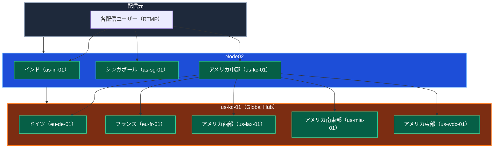

```mermaid
flowchart TB
    %% =======================================
    %% 配信全体構成図（全サーバー視聴可能）※日本リージョンからの配信の場合
    %% =======================================

    %% === 配信元 ===
    subgraph SRC["配信元"]
        A["各配信ユーザー（RTMP）"]
    end

    %% === Node02 ===
    subgraph NODE02["Node02"]
        A --> IN["インド（as-in-01）"]
        A --> SG["シンガポール（as-sg-01）"]
        A --> KC["アメリカ中部（us-kc-01）"]
    end

    %% === KCノード ===
    subgraph KCNODE["us-kc-01（Global Hub）"]
        KC --> DE["ドイツ（eu-de-01）"]
        KC --> FR["フランス（eu-fr-01）"]
        KC --> LAX["アメリカ西部（us-lax-01）"]
        KC --> MIA["アメリカ南東部（us-mia-01）"]
        KC --> WDC["アメリカ東部（us-wdc-01）"]
    end

    %% === 縦の階層構成 ===
    SRC --> NODE02
    NODE02 --> KCNODE

    %% === スタイリング ===
    classDef src fill:#1e293b,stroke:#94a3b8,color:#fff,stroke-width:2px;
    classDef asia fill:#1d4ed8,stroke:#60a5fa,color:#fff,stroke-width:2px;
    classDef kc fill:#7c2d12,stroke:#f97316,color:#fff,stroke-width:2px;
    classDef edge fill:#065f46,stroke:#34d399,color:#fff,stroke-width:1.5px;

    class SRC src;
    class NODE02 asia;
    class KCNODE kc;
    class IN,SG,KC,DE,FR,LAX,MIA,WDC edge;
```
