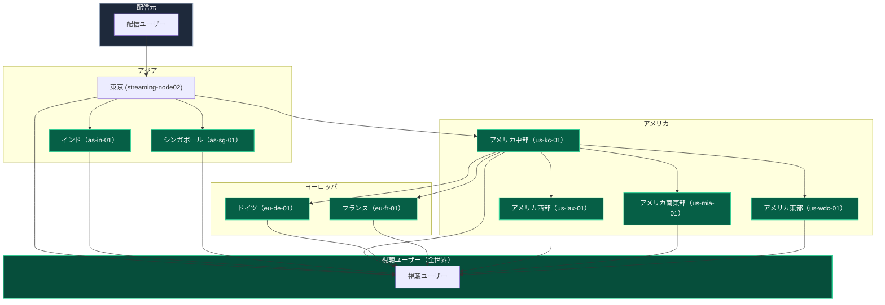

```mermaid
flowchart TB
    %% =======================================
    %% 配信全体構成図（全サーバー視聴可能）
    %% ※日本リージョンからの配信の場合
    %% =======================================

    %% === 配信元 ===
    subgraph SRC["配信元"]
        A["配信ユーザー"]
    end

    %% === Asia ===
    subgraph ASIA["アジア"]
    		A --> JP["東京 (streaming-node02)"]
        JP --> IN["インド（as-in-01）"]
        JP --> SG["シンガポール（as-sg-01）"]
    end

    %% === America ===
    subgraph AMERICA["アメリカ"]
    		JP --> KC["アメリカ中部（us-kc-01）"]
        KC --> LAX["アメリカ西部（us-lax-01）"]
        KC --> MIA["アメリカ南東部（us-mia-01）"]
        KC --> WDC["アメリカ東部（us-wdc-01）"]
    end
    
    %% === Europe ===
    subgraph EU["ヨーロッパ"]
    		KC --> DE["ドイツ（eu-de-01）"]
        KC --> FR["フランス（eu-fr-01）"]
    end

    %% === 視聴層 ===
    subgraph GLOBAL["視聴ユーザー（全世界）"]
    		JP --> Global["視聴ユーザー"]
        IN --> Global
        SG --> Global
        KC --> Global
        DE --> Global
        FR --> Global
        LAX --> Global
        MIA --> Global
        WDC --> Global
    end

    %% === スタイリング ===
    classDef src fill:#1e293b,stroke:#94a3b8,color:#fff,stroke-width:2px;
    classDef asia fill:#1d4ed8,stroke:#60a5fa,color:#fff,stroke-width:2px;
    classDef kc fill:#7c2d12,stroke:#f97316,color:#fff,stroke-width:2px;
    classDef users fill:#064e3b,stroke:#34d399,color:#fff,stroke-width:2px;
    classDef edge fill:#065f46,stroke:#34d399,color:#fff,stroke-width:1.5px;

    class SRC src;
    class NODE02 asia;
    class KCNODE kc;
    class GLOBAL users;
    class IN,SG,KC,DE,FR,LAX,MIA,WDC edge;
```
