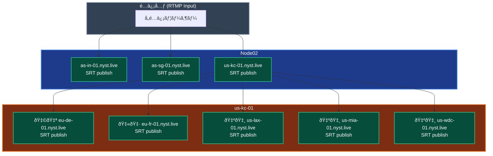

```mermaid
flowchart TD
    %% ===============================
    %% é…信全体構æˆå›³ï¼ˆå…¨ã‚µãƒ¼ãƒãƒ¼è¦–è´å¯èƒ½ï¼‰
    %% ===============================

    %% === é…ä¿¡å…ƒ ===
    subgraph SRC["é…ä¿¡å…ƒ (RTMP Input)"]
        A["å„é…信ユーザー"]
    end

    %% === Node02 ===
    subgraph NODE02["Node02"]
        A --> IN["as-in-01.nyst.live<br/>SRT publish"]
        A --> SG["as-sg-01.nyst.live<br/>SRT publish"]
        A --> KC["us-kc-01.nyst.live<br/>SRT publish"]
    end

    %% === KCノード ===
    subgraph KCNODE["us-kc-01"]
        KC --> DE["🇩🇪 eu-de-01.nyst.live<br/>SRT publish"]
        KC --> FR["🇫🇷 eu-fr-01.nyst.live<br/>SRT publish"]
        KC --> LAX["🇺🇸 us-lax-01.nyst.live<br/>SRT publish"]
        KC --> MIA["🇺🇸 us-mia-01.nyst.live<br/>SRT publish"]
        KC --> WDC["🇺🇸 us-wdc-01.nyst.live<br/>SRT publish"]
    end

    %% === スタイリング ===
    classDef src fill:#334155,stroke:#94a3b8,color:#fff,stroke-width:2px;
    classDef asia fill:#1e3a8a,stroke:#60a5fa,color:#fff,stroke-width:2px;
    classDef kc fill:#7c2d12,stroke:#f97316,color:#fff,stroke-width:2px;
    classDef edge fill:#064e3b,stroke:#34d399,color:#fff,stroke-width:1.5px;

    class SRC src;
    class NODE02 asia;
    class KCNODE kc;
    class IN,SG,KC,DE,FR,LAX,MIA,WDC edge;
```
