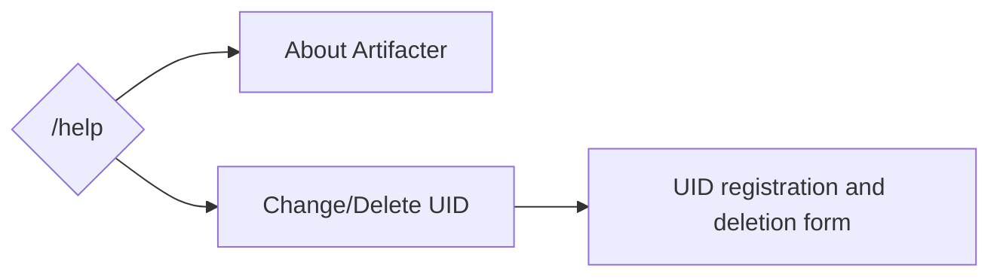

# /help
## Overview
Show command descriptions and change/delete your UID.

:::note
The content for command descriptions is the same as in [About Artifacter](/en/services/discordbot/artifacter/).
:::

## Usage
```
/help
```

## Flow

