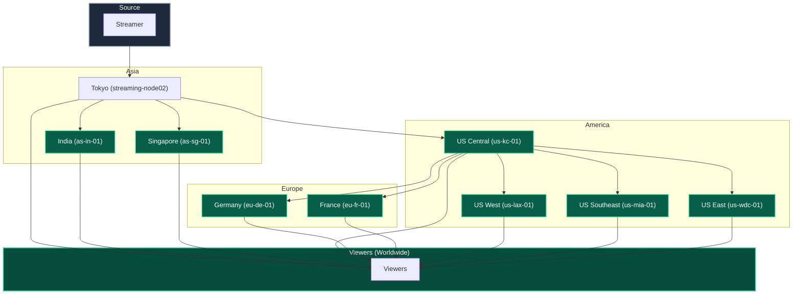

# Overall Streaming Architecture (viewable from every server)
## *For streams originating from the Japan region

```mermaid
flowchart TB

    %% === Source ===
    subgraph SRC["Source"]
        A["Streamer"]
    end

    %% === Asia ===
    subgraph ASIA["Asia"]
    		A --> JP["Tokyo (streaming-node02)"]
        JP --> IN["India (as-in-01)"]
        JP --> SG["Singapore (as-sg-01)"]
    end

    %% === America ===
    subgraph AMERICA["America"]
    		JP --> KC["US Central (us-kc-01)"]
        KC --> LAX["US West (us-lax-01)"]
        KC --> MIA["US Southeast (us-mia-01)"]
        KC --> WDC["US East (us-wdc-01)"]
    end

    %% === Europe ===
    subgraph EU["Europe"]
    		KC --> DE["Germany (eu-de-01)"]
        KC --> FR["France (eu-fr-01)"]
    end

    %% === Viewers ===
    subgraph GLOBAL["Viewers (Worldwide)"]
    		JP --> Global["Viewers"]
        IN --> Global
        SG --> Global
        KC --> Global
        DE --> Global
        FR --> Global
        LAX --> Global
        MIA --> Global
        WDC --> Global
    end

    %% === Styling ===
    classDef src fill:#1e293b,stroke:#94a3b8,color:#fff,stroke-width:2px;
    classDef asia fill:#1d4ed8,stroke:#60a5fa,color:#fff,stroke-width:2px;
    classDef kc fill:#7c2d12,stroke:#f97316,color:#fff,stroke-width:2px;
    classDef users fill:#064e3b,stroke:#34d399,color:#fff,stroke-width:2px;
    classDef edge fill:#065f46,stroke:#34d399,color:#fff,stroke-width:1.5px;

    class SRC src;
    class NODE02 asia;
    class KCNODE kc;
    class GLOBAL users;
    class IN,SG,KC,DE,FR,LAX,MIA,WDC edge;
```
