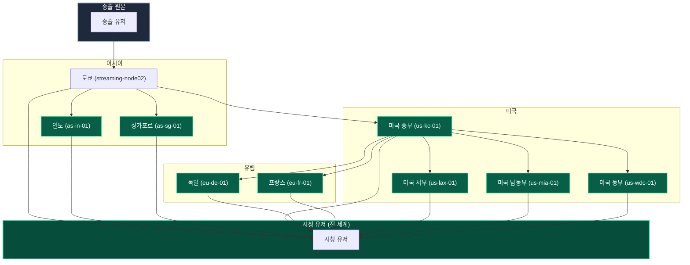

# 송출 전체 구성도 (모든 서버에서 시청 가능)
## ※일본 리전에서 송출하는 경우

```mermaid
flowchart TB

    %% === 송출 원본 ===
    subgraph SRC["송출 원본"]
        A["송출 유저"]
    end

    %% === Asia ===
    subgraph ASIA["아시아"]
    		A --> JP["도쿄 (streaming-node02)"]
        JP --> IN["인도 (as-in-01)"]
        JP --> SG["싱가포르 (as-sg-01)"]
    end

    %% === America ===
    subgraph AMERICA["미국"]
    		JP --> KC["미국 중부 (us-kc-01)"]
        KC --> LAX["미국 서부 (us-lax-01)"]
        KC --> MIA["미국 남동부 (us-mia-01)"]
        KC --> WDC["미국 동부 (us-wdc-01)"]
    end

    %% === Europe ===
    subgraph EU["유럽"]
    		KC --> DE["독일 (eu-de-01)"]
        KC --> FR["프랑스 (eu-fr-01)"]
    end

    %% === Viewers ===
    subgraph GLOBAL["시청 유저 (전 세계)"]
    		JP --> Global["시청 유저"]
        IN --> Global
        SG --> Global
        KC --> Global
        DE --> Global
        FR --> Global
        LAX --> Global
        MIA --> Global
        WDC --> Global
    end

    %% === 스타일 ===
    classDef src fill:#1e293b,stroke:#94a3b8,color:#fff,stroke-width:2px;
    classDef asia fill:#1d4ed8,stroke:#60a5fa,color:#fff,stroke-width:2px;
    classDef kc fill:#7c2d12,stroke:#f97316,color:#fff,stroke-width:2px;
    classDef users fill:#064e3b,stroke:#34d399,color:#fff,stroke-width:2px;
    classDef edge fill:#065f46,stroke:#34d399,color:#fff,stroke-width:1.5px;

    class SRC src;
    class NODE02 asia;
    class KCNODE kc;
    class GLOBAL users;
    class IN,SG,KC,DE,FR,LAX,MIA,WDC edge;
```
