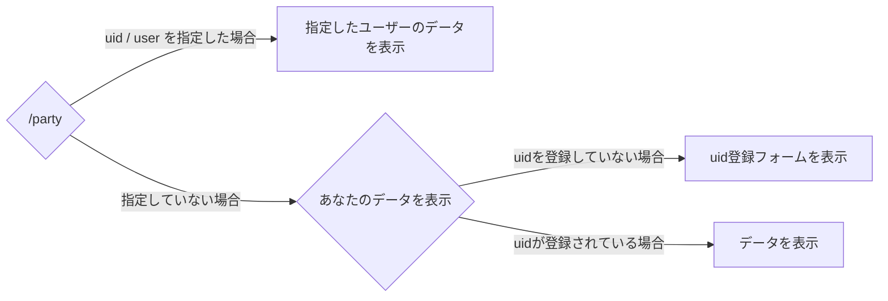

# /party
## 概要
原神のパーティービルドカードを生成します。

## 使用方法
```
/party <option>
```

オプション名 | 概要 | 必須
--- | --- | --
uid / user | 他のユーザーのデータを表示します。 | いいえ
score | スコアの計算式を変更します。 | いいえ

scoreオプションの値
scoreオプションには、以下のいずれかを指定できます。
- 攻撃力換算
- HP換算
- 防御力換算
- 元素チャージ効率換算
- 元素熟知換算


## 動作


## 生成後画像プレビュー

