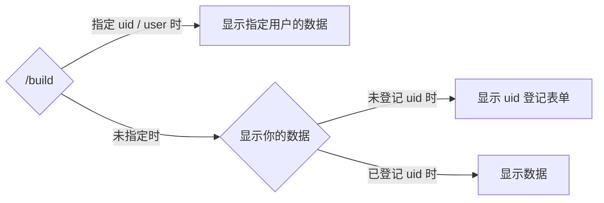

# /build-hsr
## 概述
生成《崩坏：星穹铁道》的配装卡。

## 使用方法
```
/build-hsr <option>
```

选项名称 | 概述 | 是否必填
--- | --- | --
uid / user | 显示其他用户的数据。 | 否

## 工作流程

```mermaid
graph LR
    A{/build}
    A -->|指定 uid / user 时| B[显示指定用户的数据]
    A -->|未指定时| C{显示你的数据}
    C -->|未登记 uid 时| D[显示 uid 登记表单]
    C -->|已登记 uid 时| E[显示数据]
```

## 生成图像预览

