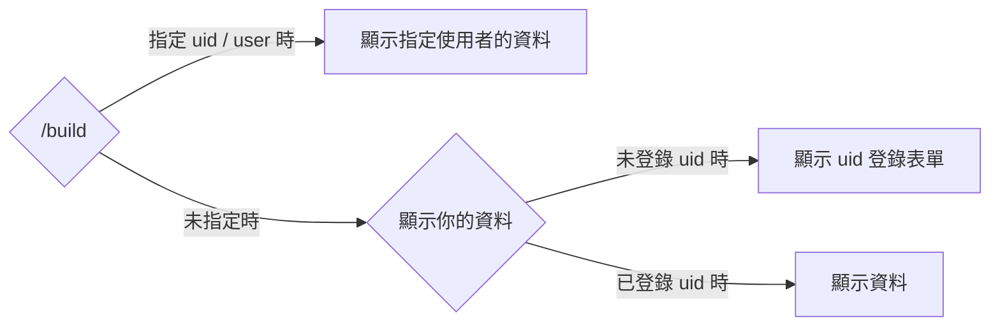

# /build-hsr
## 概述
生成《崩壞：星穹鐵道》的配裝卡。

## 使用方法
```
/build-hsr <option>
```

選項名稱 | 概述 | 是否必填
--- | --- | --
uid / user | 顯示其他使用者的資料。 | 否

## 工作流程

```mermaid
graph LR
    A{/build}
    A -->|指定 uid / user 時| B[顯示指定使用者的資料]
    A -->|未指定時| C{顯示你的資料}
    C -->|未登錄 uid 時| D[顯示 uid 登錄表單]
    C -->|已登錄 uid 時| E[顯示資料]
```

## 生成圖片預覽

